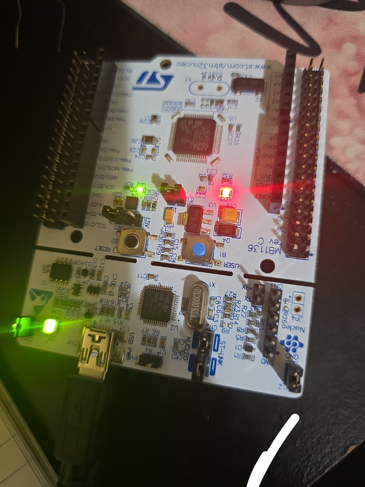

# Niloofar-stm32-Lab
Journey to embedded mastery—STM32F4 demos, diagrams, and clean CubeIDE code.

New-Item docs\fig_hw_block.png    -ItemType File
New-Item docs\power_profile.xlsx  -ItemType File
New-Item fw\EnvNode.ioc           -ItemType File

Niloofar’s STM32 Lab
Hands-on mini-projects for the NUCLEO-F401RE to practice core MCU skills (GPIO, timers, interrupts, UART, I²C, ADC, DMA, FreeRTOS, and low-power). Each demo is small, documented, and easy to import into STM32CubeIDE.

Repo Map
bash
Copy
Edit
.
├── blink_LED/          # Demo 01: LD2 blink (CubeIDE project)
├── docs/               # Diagrams, screenshots, photos, GIFs
├── fw/                 # (Optional) shared headers/helpers for future demos
├── test/               # Simple test notes/scripts (if any)
├── LICENSE             # MIT
└── README.md
Tip: Keep each demo self-contained (one CubeIDE project per folder) so nothing breaks when you add new features.

Board & Tools
Board: NUCLEO-F401RE (on-board user LED LD2 = PA5 = Arduino D13)

IDE: STM32CubeIDE 1.19.0 (HAL)

Programmer: ST-LINK (integrated on Nucleo)

Host OS: Windows 10 (works on macOS/Linux too)

How to Import a Demo (CubeIDE)
Clone the repo
git clone https://github.com/nilooeli/Niloofar-stm32-Lab.git

Open STM32CubeIDE → File ▸ Import… ▸ Existing Projects into Workspace

Browse to the demo folder (e.g. blink_LED/) → Finish

Build (hammer icon) → Debug/Run (green bug/play)

Demo 01 — LED Blink
Goal: Toggle the on-board LED LD2 to verify GPIO output and project setup.
#### Demo Gallery

Pin & Clock
LD2: GPIOA → PIN_5 (push-pull, no pull, low speed is fine)

Clock: default HSI/HSE is fine; HAL_Delay() uses SysTick

Key Code (simplified)
c
Copy
Edit
// After HAL_Init(), SystemClock_Config(), and MX_GPIO_Init()
while (1) {
    HAL_GPIO_TogglePin(GPIOA, GPIO_PIN_5); // LD2 on PA5
    HAL_Delay(500); // ms; change for faster/slower blink
}
Change the Blink Rate
Edit the HAL_Delay(…) value, rebuild, and flash.

Or use a timer interrupt later for precise non-blocking timing.

What You Should See
The green LED near the Arduino D13 header blinks at ~2 Hz (500 ms on/off).

Troubleshooting
Nothing blinks

Check power LED is on; USB cable supports data.

Confirm PA5 is set as GPIO_Output in .ioc (and MX_GPIO_Init() is called).

Make sure you imported the project folder, not just source files.

Clean build: Project ▸ Clean… then build again.

ST-LINK not found: Run ▸ Debug Configurations… ▸ STM32 Cortex-M C/C++ Application → select the right project/ELF; update ST-LINK firmware via STM32CubeProgrammer if needed.

Build errors about HAL headers

The generated Core/Inc and Drivers include paths must exist. If missing, regenerate code from the .ioc or re-import the project.

Delay is wrong

Check SystemClock_Config() runs and HAL_Init() sets SysTick. Avoid changing SysTick if you later add FreeRTOS.

Git Tips (short)
Commit per demo step; write clear messages, e.g. demo(blink): initial GPIO PA5

Tag stable milestones, e.g. demo/led-blink-v1

Keep build folders out of Git with a .gitignore (add /Debug/, /Release/, /build/, .settings/)

Example .gitignore:

swift
Copy
Edit
/Debug/
/Release/
/build/
/*.log
*.ioc-backup
.settings/
